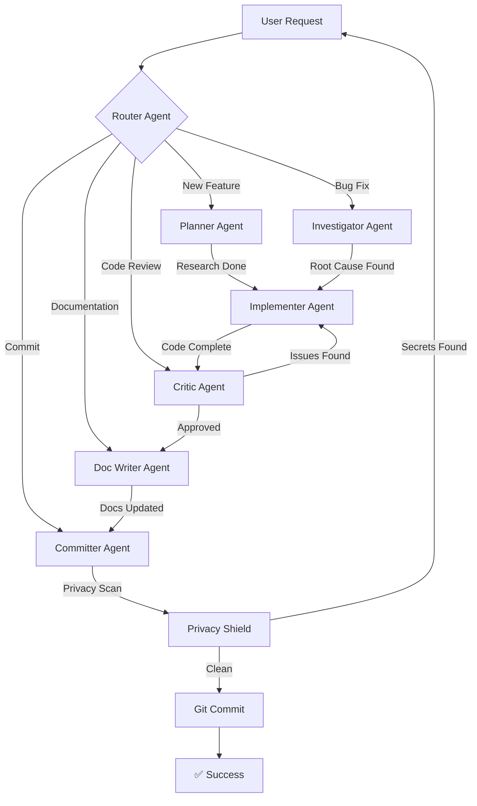

# Agent Orchestration System

**Version:** 1.0.0  
**Last Updated:** 2026-01-14

This system implements multi-agent workflow orchestration based on LangGraph patterns and industry best practices.

---

## Architecture Overview



---

## Agent Roster

| Agent | Role | Trigger | Output |
|-------|------|---------|--------|
| **Router** | Request analysis & routing | Every request | Routes to specialist |
| **Planner** | Feature planning & research | Feature requests | Implementation plan |
| **Investigator** | Bug analysis & diagnosis | Bug reports | Root cause analysis |
| **Implementer** | Code implementation | From Planner/Investigator | Working code |
| **Critic** | Quality assurance & review | After implementation | Review report |
| **Doc Writer** | Documentation updates | After approval | Updated docs |
| **Committer** | Git operations | Final step | Commit message |
| **Privacy Shield** | Secret scanning | Pre-commit | Security verification |

---

## Communication Protocol

### Message Format

All agent-to-agent communication follows this structure:

```typescript
interface AgentMessage {
    from: AgentName;
    to: AgentName;
    timestamp: string;
    task: string;
    context: {
        files?: string[];
        research?: any;
        decisions?: string[];
        issues?: Issue[];
        [key: string]: any;
    };
    status: 'in-progress' | 'completed' | 'blocked';
    next_action: string;
}
```

### Example Message

```json
{
    "from": "planner-agent",
    "to": "implementer-agent",
    "timestamp": "2026-01-14T10:30:00Z",
    "task": "Implement dark mode toggle",
    "context": {
        "files": ["style.css", "index.html", "script.js"],
        "research": {
            "library": "CSS Color Module Level 5",
            "best_practice": "Use prefers-color-scheme with CSS variables",
            "references": ["https://..."]
        },
        "decisions": [
            "Use CSS variables over class toggle",
            "Respect system preference by default"
        ],
        "success_criteria": [
            "Toggle works correctly",
            "Theme persists in localStorage",
            "Accessible",
            "Smooth transitions"
        ]
    },
    "status": "completed",
    "next_action": "implement_feature"
}
```

---

## Workflow Examples

### Example 1: Feature Request

**User:** "Add task filtering by date range"

```
[Router] 🎯 Analyzing request...
→ Intent: New feature
→ Complexity: Medium
→ Routing to: Planner Agent

[Planner] 📋 Planning feature...
→ Querying Context7 for date picker best practices...
→ Research complete
→ Implementation plan ready
→ Handoff to: Implementer Agent

[Implementer] ⚙️ Implementing...
→ Added date picker component
→ Implemented filtering logic
→ Tested on all viewports
→ Handoff to: Critic Agent

[Critic] 🔎 Reviewing code...
→ Security: ✅ No issues
→ Accessibility: ⚠️ Missing ARIA label
→ Performance: ✅ Optimized
→ Handoff to: Implementer Agent (fix required)

[Implementer] ⚙️ Applying fix...
→ Added aria-label to date picker
→ Handoff to: Critic Agent

[Critic] 🔎 Re-reviewing...
→ All issues resolved ✅
→ Overall score: 9.2/10
→ Handoff to: Doc Writer Agent

[Doc Writer] 📝 Updating documentation...
→ README Features section updated
→ Usage example added
→ Handoff to: Committer Agent

[Committer] 💾 Preparing commit...
→ Running Privacy Shield scan...
→ Privacy Shield: ✅ Clean
→ Generating commit message...

SUGGESTED COMMIT:
feat(tasks): add date range filtering

Users can filter tasks by creation or due date.

- Add date picker component
- Implement date filtering logic
- Add UI controls for date range
- Persist filter state in localStorage
- Add accessibility improvements

FILES:
- script.js
- index.html
- style.css
- README.md

Ready to commit? (y/n)
```

### Example 2: Bug Fix

**User:** "Tasks aren't saving after page refresh"

```
[Router] 🎯 Analyzing request...
→ Intent: Bug fix
→ Severity: High (data loss)
→ Routing to: Investigator Agent

[Investigator] 🔍 Investigating bug...
→ Searching codebase for saveTask function...
→ Found in script.js:245
→ Root cause: Missing JSON.stringify in localStorage.setItem
→ Impact: Tasks not persisted
→ Solution: Add serialization
→ Handoff to: Implementer Agent

[Implementer] ⚙️ Fixing bug...
→ Added JSON.stringify in saveTask()
→ Added error handling for quota exceeded
→ Added user notification on failure
→ Tested: Create task → Refresh → Task persists ✅
→ Handoff to: Critic Agent

[Critic] 🔎 Reviewing fix...
→ Security: ✅ No issues
→ Edge cases: ✅ Quota handled
→ Error handling: ✅ User-friendly messages
→ Overall score: 9.5/10
→ Handoff to: Doc Writer Agent

[Doc Writer] 📝 Updating docs...
→ No README changes needed (internal fix)
→ Added inline comments to explain serialization
→ Handoff to: Committer Agent

[Committer] 💾 Preparing commit...
→ Privacy Shield: ✅ Clean

SUGGESTED COMMIT:
fix(tasks): ensure tasks persist after page reload

Fixed localStorage serialization issue causing data loss.

- Add JSON.stringify in saveTask()
- Add error handling for quota exceeded
- Add user notification on save failure
- Add inline comments explaining serialization

FILES:
- script.js

Ready to commit? (y/n)
```

---

## Agent Configuration

Each agent is configured via a markdown file in `.github/agents/`:

```
.github/agents/
├── router-agent.md          # Request routing logic
├── planner-agent.md         # Feature planning & research
├── investigator-agent.md    # Bug investigation
├── implementer-agent.md     # Code implementation
├── critic-agent.md          # Quality assurance
├── doc-writer-agent.md      # Documentation updates
└── committer-agent.md       # Git operations
```

---

## Triggering Mechanism

### Automatic Triggers

Agents are automatically triggered based on:

1. **User Intent Detection**
   - Keywords analysis
   - Natural language understanding
   - Context from conversation history

2. **Workflow Stage**
   - After planning → Implementer
   - After implementation → Critic
   - After approval → Doc Writer
   - Final step → Committer

3. **Pre-defined Hooks**
   - `pre_implement` → Critic (optional pre-review)
   - `pre_commit` → Privacy Shield (mandatory)
   - `post_commit` → Doc Writer (update docs)

### Manual Triggers

Users can explicitly invoke agents:

```
"@planner analyze this feature request"
"@critic review this code"
"@investigator debug this issue"
```

---

## State Management

### Conversation State

```typescript
interface ConversationState {
    thread_id: string;
    active_agent: AgentName;
    agent_history: AgentMessage[];
    user_messages: UserMessage[];
    context: {
        files_modified: string[];
        current_task: string;
        pending_issues: Issue[];
        decisions: string[];
    };
    checkpoints: Checkpoint[];
}
```

### Checkpoint System

After each agent completes work, a checkpoint is saved:

```typescript
interface Checkpoint {
    agent: AgentName;
    timestamp: string;
    state_snapshot: ConversationState;
    outputs: any;
    can_rollback: boolean;
}
```

This allows:
- Rollback to previous states
- Replay agent decisions
- Debugging workflow issues

---

## Quality Gates

### Gate 1: Privacy Shield (Mandatory)

**Trigger:** Before any commit  
**Blocker:** Yes (stops commit if secrets found)  
**Agent:** Privacy Shield

```
[Privacy Shield] 🛡️ Scanning for secrets...
→ Scanning 3 files...
→ No secrets detected ✅
→ Safe to commit
```

### Gate 2: Critic Review (Recommended)

**Trigger:** After implementation  
**Blocker:** No (warns but allows proceed)  
**Agent:** Critic Agent

```
[Critic] 🔎 Review status: ⚠️ NEEDS FIXES
→ Found 2 medium-priority issues
→ Recommend fixing before commit
→ Proceed anyway? (y/n)
```

### Gate 3: Breaking Change Check (Conditional)

**Trigger:** If API changes detected  
**Blocker:** Yes (requires explicit confirmation)  
**Agent:** Committer Agent

```
[Committer] ⚠️ BREAKING CHANGE DETECTED
→ This change modifies public API
→ Migration guide required in commit message
→ Continue? (y/n)
```

---

## Developer Output Format

### What Developers Want to See

Based on research, developers want:

1. **🎯 Clear routing decision**
   ```
   [Router] Detected: Feature request → Routing to Planner Agent
   ```

2. **📊 Progress visibility**
   ```
   [Planner] ████████░░ 80% - Finalizing implementation plan
   ```

3. **✅ Quality checkpoints**
   ```
   [Critic] Review complete: 9.2/10 - 1 minor issue found
   ```

4. **💬 Transparent handoffs**
   ```
   [Planner → Implementer] Context passed: 
   - Research findings
   - Implementation plan
   - Success criteria
   ```

5. **🎯 Actionable summaries**
   ```
   READY TO COMMIT:
   feat(tasks): add date filtering
   
   Files: 3
   Changes: +87 -12
   Quality: 9.2/10
   
   Commit? (y/n)
   ```

### Output Template

```markdown
[Agent Name] Icon Status Message
→ Sub-action 1
→ Sub-action 2
→ Sub-action 3

Results:
- Result 1
- Result 2

Next: Handoff to [Next Agent]
```

---

## Performance Monitoring

Track agent performance metrics:

```typescript
interface AgentMetrics {
    agent_name: string;
    invocations: number;
    avg_duration_ms: number;
    success_rate: number;
    handoff_rate: number;
    issues_found: number;
    issues_fixed: number;
}
```

**Example dashboard:**

```
AGENT PERFORMANCE (Last 30 days)

Router Agent:
- Invocations: 150
- Avg duration: 125ms
- Routing accuracy: 97%

Planner Agent:
- Invocations: 85
- Avg duration: 3.2s (Context7 queries)
- Plans accepted: 94%

Critic Agent:
- Invocations: 120
- Avg duration: 2.1s
- Issues found: 245
- Critical issues: 8
- Approval rate: 78%

Implementer Agent:
- Invocations: 95
- Avg duration: 15.5s
- Rework rate: 22% (from Critic feedback)
```

---

## Customization

### Adding a New Agent

1. Create agent config file:
   ```bash
   touch .github/agents/your-agent.md
   ```

2. Define agent in config:
   ```markdown
   # Your Agent Configuration
   **Role:** [description]
   **Triggers:** [when it activates]
   **Output:** [what it produces]
   ```

3. Add routing logic in router-agent.md

4. Update orchestration.md (this file)

### Modifying Agent Behavior

Edit the agent's markdown file in `.github/agents/`.

Changes take effect immediately - no restart needed.

---

## Best Practices

### For Agent Designers

1. **Single Responsibility** - Each agent has one clear purpose
2. **Clear Handoffs** - Always specify next agent
3. **Context Preservation** - Pass all relevant context
4. **Idempotency** - Same input = same output
5. **Observable** - Log all decisions and actions

### For Users

1. **Be Specific** - Clear requests get better routing
2. **Trust the Process** - Let agents collaborate
3. **Review Outputs** - Verify agent work
4. **Provide Feedback** - Help improve routing

---

## Troubleshooting

### Agent Not Triggering

**Symptoms:** Expected agent doesn't activate

**Solutions:**
1. Check router-agent.md routing rules
2. Verify trigger keywords match
3. Check agent configuration file exists
4. Review conversation context

### Infinite Loop

**Symptoms:** Agents keep handing off to each other

**Solutions:**
1. Check for circular dependencies
2. Add max iteration limit
3. Review handoff conditions
4. Add explicit termination criteria

### Poor Routing Decisions

**Symptoms:** Wrong agent chosen for task

**Solutions:**
1. Improve intent detection keywords
2. Add more training examples
3. Adjust routing confidence threshold
4. Allow manual agent override

---

## Future Enhancements

### Planned Features

1. **Parallel Agent Execution**
   - Run Critic + Doc Writer simultaneously
   - Faster workflow completion

2. **Agent Learning**
   - Track which routes work best
   - Improve routing over time

3. **Custom Agent Templates**
   - User-defined specialist agents
   - Project-specific workflows

4. **Visual Workflow Editor**
   - Drag-and-drop agent connections
   - No-code workflow creation

5. **Agent Marketplace**
   - Share successful agent configs
   - Import community agents

---

## References

- [LangGraph Multi-Agent Patterns](https://langchain-ai.github.io/langgraphjs)
- [Awesome Agentic Patterns](https://github.com/nibzard/awesome-agentic-patterns)
- [CriticGPT-Style Evaluation](https://openai.com/research/critiquing-llm-outputs)
- [Swarm Multi-Agent Systems](https://github.com/langchain-ai/langgraph-swarm-py)

---

**This orchestration system creates a collaborative multi-agent workflow that produces high-quality, well-documented code.** 🤖✨
